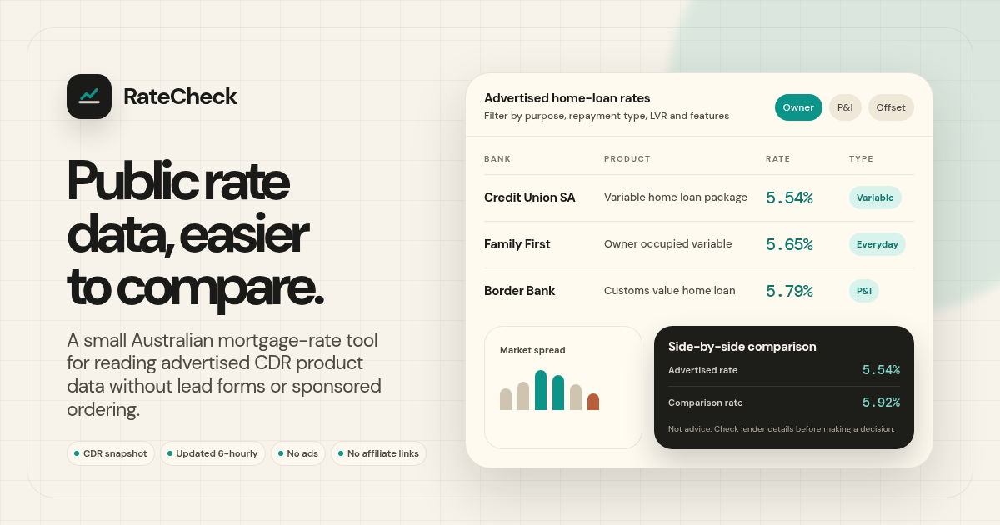

[](https://ratecheckau.homes)

# RateCheck 🇦🇺

**Free Australian mortgage rate comparison. No ads, no affiliate links, no bias.**

Compare advertised home loan rates from the current CDR open banking snapshot, updated every 6 hours.

**[ratecheckau.homes](https://ratecheckau.homes)**

> **For Australians only.** This tool covers Australian lenders and uses Australian government CDR data. Not relevant outside Australia.

---

## What it does

Australian banks are legally required to publish their mortgage rates through the [Consumer Data Right (CDR)](https://www.cdr.gov.au/) APIs. RateCheck pulls those rates every 6 hours and puts them all in one place so you can compare without signing up, talking to a broker, or anyone earning a commission from your click.

- Filter by variable/fixed, owner-occupied/investment, P&I/interest only, LVR, and bank
- See cashback offers, offset accounts, redraw, and other features per product
- Spot revert rates — the higher rate banks charge if you don't qualify for their discount
- Compare selected loans side by side
- Analytics page with rate history, LVR band comparisons, feature prevalence, and market trends
- Download filtered results as CSV
- Works entirely in your browser, no account needed

## Not financial advice

Rates shown are the advertised rates banks publish through CDR. The rate you'd actually get depends on your circumstances. Always confirm with the lender directly and get independent advice before making any decisions about a home loan.

---

## How it works

A Go program runs every 6 hours via GitHub Actions. It queries the CDR Register to discover participating banks, fetches their mortgage products, and writes the browser data from the current snapshot:

- `public/rates.db` — latest snapshot only, loaded in the browser via WebAssembly
- `public/analytics.json` — pre-computed history stats, fetched by the Analytics page
- `public/product-details/` — raw CDR product detail JSON, lazy-loaded when product-level detail is needed

Full 30-day history is kept in `history.db` via the Actions cache and used to compute analytics, but never served to browsers.

```
CDR Register -> Go aggregator -> history.db (Actions cache, never served)
                              -> public/rates.db (latest snapshot)
                              -> public/product-details/ (raw CDR product details)
                              -> public/analytics.json (pre-computed trends)
                                       |
                            Cloudflare CDN -> Browser
                            sql.js WASM loads rates.db
                            SQL queries power filtering/sorting
```

---

## Development

### Prerequisites

- [Bun](https://bun.sh/) for the frontend
- [Go 1.26+](https://go.dev/dl/) for the aggregator
- [golangci-lint v2](https://golangci-lint.run/welcome/install/) for Go linting

### Quick start

```sh
git clone https://github.com/hueyexe/ratecheck-au.git
cd ratecheck-au

# frontend
bun install
bun run dev

# aggregator (optional, rates.db is already committed)
cd aggregator
go run .
```

### Commands

```sh
# frontend
bun run build        # typecheck + production build
bun run lint         # eslint
bun run worker:deploy  # deploy Cloudflare Worker for /api/feedback
bun run worker:tail    # stream Worker logs

# aggregator
cd aggregator
go build ./...
golangci-lint run ./...
```

### Site feedback setup

The website feedback form posts to `ratecheckau.homes/api/feedback`. A Cloudflare Worker validates the submission and triggers the `site_feedback` GitHub Action, which creates a public issue as `github-actions[bot]`.

One secret is required before deploying the Worker:

```sh
# first-time only: upload a Worker version without attaching the public route
bunx wrangler versions upload

# add the GitHub token as a Cloudflare secret, then attach the route
wrangler secret put GITHUB_DISPATCH_TOKEN
bun run worker:deploy
```

Use a fine-grained GitHub token limited to this repository. It needs `Contents: Read and write` so it can call `repository_dispatch` for `hueyexe/ratecheck-au`.

### Tech stack

- React + TypeScript + Vite + Tailwind CSS v4
- sql.js (SQLite in the browser via WASM)
- Recharts for analytics charts
- @tanstack/react-virtual for table virtualisation
- Go 1.26 + modernc.org/sqlite for the aggregator
- Bun as package manager
- Cloudflare CDN + GitHub Pages for hosting

### Project layout

```
aggregator/
  main.go            entry point, concurrency
  register.go        CDR Register API client
  products.go        bank product/rate fetching + revert rate detection
  db.go              SQLite write + writeStrippedDB()
  analytics.go       pre-compute analytics.json from full history
  meta.go            meta.json export
  types.go           type definitions
public/
  rates.db           latest snapshot only (~2.7 MB)
  analytics.json     pre-computed history stats
  meta.json          metadata
  CNAME              ratecheckau.homes
src/
  App.tsx            root component, DB init
  db.ts              sql.js wrapper, query functions
  types.ts           shared interfaces
  index.css          Tailwind + design tokens (oklch)
  hooks/
    useUrlState.ts   filter state <-> URL params
    useSEO.ts        per-route title/description
  components/
    Header.tsx       RateCheck wordmark, pill nav
    Dashboard.tsx    hero stat + charts
    Filters.tsx      filter pills + search
    RateTable.tsx    virtualised table / mobile cards
    AnalyticsPage.tsx  rate history + LVR + feature charts
    CompareDrawer.tsx  side-by-side bank comparison
    ProductDetail.tsx  feature and eligibility details from CDR
    AboutPage.tsx    plain-language about page
.github/workflows/
  update-rates.yml   fetch rates every 6h, cache history.db, commit
  deploy.yml         build + deploy to GitHub Pages
  site-feedback.yml  create GitHub issues from website feedback
worker/
  feedback-worker.ts Cloudflare Worker for /api/feedback
```

### Contributing

See [AGENTS.md](AGENTS.md) for the full code style guide and design context.

## License

[MIT](LICENSE)
